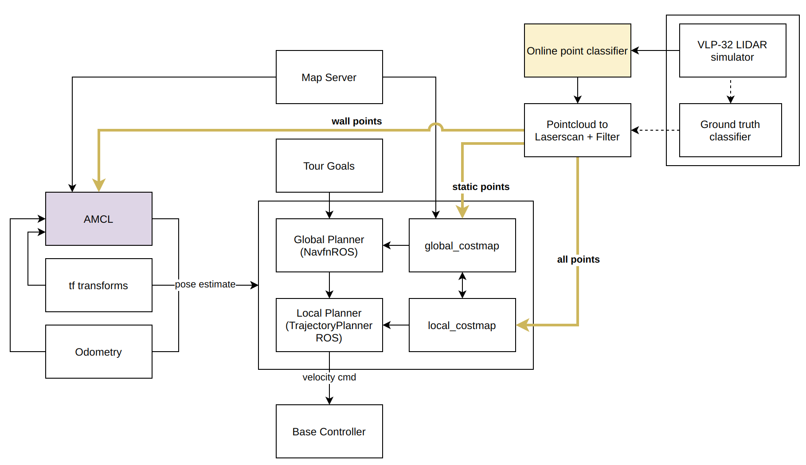
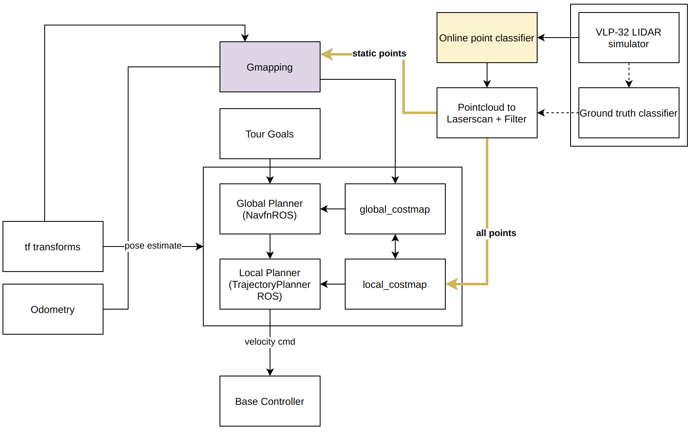

# Myhal Tour Guide Project 

## Table of Contents

  * [Usage](#usage)
     * [Dependencies](#dependencies)
     * [Installation](#installation)
     * [Running the Simulation](#running-the-simulation)
     * [The Data](#the-data)
  * [The Navigation Stack](#the-navigation-stack)
     * [Point-cloud conversion and filtering](#point-cloud-conversion-and-filtering)
     * [Localization](#localization)
     * [Cost-maps](#cost-maps)
     * [Planning](#planning)
  * [Simulation Details](#simulation-details)
     * [World Generation](#world-generation)
     * [World Control](#world-control)
     * [Ground Truth Classifications](#ground-truth-classifications)
  * [Dashboard](#dashboard)

## Usage

### Dependencies

ROS-melodic and Gazebo9 are used in this simulation, along with various other ROS packages and external dependencies.
A GPU is required to run the Velodyne VLP-32 LiDAR simulation.
See [this Dockerfile](https://github.com/BenAgro314/ROS-Dockerfiles/blob/master/docker_ros_melodic/Dockerfile) for a list of the required programs and environment variables to run the simulation.

### Installation

This repository should be located in /home/$USER/catkin\_ws, meaning the root JackalTourGuide folder should be renamed to catkin\_ws:

``` bash
cd ~
git clone https://github.com/BenAgro314/JackalTourGuide.git catkin_ws 
```

For data storage, there must be a directory ~/Myhal\_Simulation/simulated\_runs/:

``` bash
cd ~
mkdir -p Myhal_Simulation/simulated_runs/
```

### Running the Simulation

#### Master Script

To run the simulation, call the `master.sh` script. This script has many options (listed by frequency of use):

-t [arg], the name of the tour being used (default = A\_tour). The tour files can be found in src/myhal\_simulator/tours/.

-f, if set, the simulation will use point-cloud filtering. If there is no online classification, the -g flag must be passed as well.

-g, if set, the simulation will use ground truth LiDAR classifications.

-m, if set, the simulation will use [Gmapping](http://wiki.ros.org/gmapping) for SLAM, otherwise it will use [AMCL](http://wiki.ros.org/amcl) for localization only.

-e, if set, various topics (pose estimate, global plan, local plan, and current target) will be visualized in the simulation.

-v, if set, the GUI for Gazebo and Rviz will be launched.

-l [arg], if this option is given, the simulation will load the provided world file located in /home/$USER/Myhal\_Simulation/simulated\_runs/[arg], otherwise it will generate a new world based on the specified parameters (default = None).

-p [arg], what parameter file is being used (default = default\_params).

For example, some common calls are:

+ `./master.sh -t E_tour -emfg`
+ `./master.sh -t J_tour -v -l 2020-08-04-17-04-21`

The first command would launch the simulation with the tour `E_tour`, visualize topics in the simulation, use Gmapping and ground truth classifications with point-cloud filtering.
The second command would launch the simulation with the tour `J_tour` along with a GUI, and load the world file from the previous run `2020-08-04-17-04-21`.

#### Parameter Specification

Parameter directories are located in src/myhal\_simulator/params/. The default parameters are in a directory called default\_params. 
The files in this folder can be modified directly, or a copy of this folder can be made.
To use a non-default parameter directory, it's name must be specified using the -p flag when calling `master.sh` (see [above section](#Master-Script)).
The files that have parameters to be modified are (in order of usefulness):

- room\_params\_V2.yaml
- scenario\_params\_V2.yaml
- camera\_params.yaml
- common\_vehicle\_params.yaml 
- plugin\_params.yaml 
- model\_params.yaml 
- animation\_params.yaml 

##### Room Parameters

Room parameters are specified in room\_params\_V2.yaml.
The name of any room to be included in the simulation must be included in the list `room_names`.
Each room name has a corresponding entry in the form (note that angled braces are meant to be filed in with a name):

```yaml
<room_name>:
    geometry: <geo_name> # specifies the name of the geometry list
    position: <pos_name> # specifies the name of the position list 
    enclosed: <"0" or "1"> # whether or not people can enter and exit the room 
    scenario: <scenario_name> # the scenario in the room, see scenario params

<geo_name>: # this specifies the rectanglar bounds of the room
    x_min: <float>
    y_min: <float>
    x_max: <float>
    y_max: <float>

<pos_name>: # this specifies the suitable posiions to place tables and chairs as (x,y) pairs. This can be as long as desired.
    - <float x1> 
    - <float y1>
    - <float x2> 
    - <float y2>
```

Note: the reason for the convoluted yaml specification is because ROS only allows lists and dictionaries of primitive data types to be loaded to the parameter sever.
This is a problem I am actively working on fixing by bypassing the parameter server all together and reading a yaml file directly.

##### Scenario Parameters

Scenario parameters are specified in scenario\_params\_V2.yaml.
The name of any scenario to be included in the simulation must be included in the list `scenario_names`.
Each scenario name has a corresponding entry in the form:

```yaml
<scenario_name>:
  pop_density: <float as a string> # specifies the population density of the scenario in people/m^2
  table_percentage: <float between "0" and "1" as a string> # specifies what percentage of the avaible model positions will be filled in the room
  actor: <actor_type> # see the model params file
  model_list: <model_list> # which models are available to be placed in the room, see the model params file
  table_group_list: <table_list> # which table groups are available to be placed in the room, see the model params file
```

More parameter descriptions are on the way.

### The Data

Whenever you run the simulation, a date stamped folder will be created in this directory eg. ~/Myhal\_Simulation/simulated\_runs/2020-08-06-22-45-03.
This folder will contains log files and post-processed data:

- raw\_data.bag, a bag file of data from select topics during the run (see line ~119 in ./master.sh).
- gt\_pose.ply, a binary representation of the ground truth pose of the robot during it's tour.
- sim\_frames/, a directory containing binary time-stamped point-cloud frames

Also contained in this directory is a directory called is a logs-<date> (e.g. logs-2020-08-06-22-45-03) which holds:

- processed\_data.pickle, serialized data used by the [Dashboard](#Dashboard) for assessing navigation performance and creating plots.
- pcl.txt and params.yaml are log files storing all the parameters used during the trials. 
- log.txt stores the command used to launch the simulation and whether or not the robot made it to each waypoint on it's tour. 
- meta.json stores meta data (see src/dashboard/src/meta\_data.py) about the run which is used by the [Dashboard](#Dashboard) for data management and creating plot series.
- myhal\_sim.world, a copy of the world file used during this run. 
- videos/, a directory that holds the videos produced during the run.

Note that if the run is cut short with SIGTERM, or by running either of the files scripts/shutdown.sh or scripts/clear.sh, all data files will be deleted.
To stop a run while saving the data files, run `./scripts/save_shutdown.sh`.

## The Navigation Stack 

The two diagrams below depict two configurations of the navigation stack, the first using AMCL and the second using Gmapping.
If ground truth classifications are used, then the points go the ground truth classification node instead of the online classifier, following the dotted lines.
Various nodes of the navigation stack are discussed below.





### Point-cloud conversion and filtering 

Currently, the main localization nodes used (see [below](#Localization)) subscribe to 2D laser-scan messages, not 3D point-clouds.
This means that the 3D point-cloud data must be converted to a 2D laser-scan. This is done via pcl\_filter\_nodlet.cpp located in the jackal\_velodyne package.
Moreover, it is in this conversion step that the classified point-cloud is segregated into different laser-scan messages depending on which parts of the navigation stack we want the various classes to go.
For example, the global planning node will be given a laser-scan message made from the points classified as non-moving, whereas the local planning node message will include all classes of points. 
See the figures above for more detail as to where the classes are sent depending on the localization node used.

### Localization

There are currently two available nodes for robot localization: [AMCL](http://wiki.ros.org/amcl) and [Gmapping](http://wiki.ros.org/gmapping). Both nodes subscribe to a 2D laser-scan and publish a transformation from the odom frame to the map frame. 

#### AMCL

The AMCL node is used purely for localization. It does not create a live map of the environment itself, and thus must be supplied a pre-made occupancy grid map via the map server of the Myhal simulation walls.
When estimating robot pose, AMCL will compare the laser-scans against the map. Thus, to increase localization accuracy when using AMCL, the node will only receive laser-scans constructed from the LiDAR points in the wall class.

#### Gmapping

The Gmapping node provides a SLAM algorithm, not only localizing the robot but providing a building an occupancy grid map at run-time. This means that no pre-made map is needed when using Gmapping.
The map that Gmapping produces is fed directly to the global planner (see below), and thus it is given laser-scans constructed from all static points (walls, tables, chairs etc), so they can be avoided.

### Cost-maps

Both global and local cost-maps are produced using the ROS package [costmap\_2d](http://wiki.ros.org/costmap_2d).
If Gmapping is used, it produces a global occupancy grid which is given to costmap\_2d to create the global cost-map.
If AMCL is used, the costmap\_2d directly subscribes to a laser-scan of consisting of static points.
Regardless of the localization node, the local cost-map is built off of a laser-scan consisting of all points (for local collision avoidance). 

The parameter files for the cost-maps can be found in src/jackal\_velodyne/params/ 

### Planning

#### Global Planner:

The global planner is sent tour goals via the node navigation\_goals\_V2.cpp. Using the global cost-map, it plans a route for the Jackal to follow.
The ROS package used to generate the plan is [navfn](http://wiki.ros.org/navfn) which uses Dijkstra's algorithm.

#### Local Planner:

The local planner's goal is the position furthest along the global path that is also within the bounds of the local cost-map.
The local planner has the responsibility of controlling the mobile base, providing the connection between the global plan and the robot.
This local planner uses the ROS package [base\_local\_planner](http://wiki.ros.org/base_local_planner) which in turn uses [Dynamic Window Approach](https://ieeexplore.ieee.org/document/580977?arnumber=580977) algorithm to create a kinematic local trajectory for the Jackal.

The parameter files for the planners can be found in src/jackal\_velodyne/params/ 

## Simulation Details

### World Generation

If the simulation is launched without specifying a world file to use (with the -l tag), then a new world is created.
To create a world based on the supplied parameters, the file src/myhal\_simulator/worlds/myhal\_sim.world is written by the program world\_factory.cpp located in the myhal\_simulator package.
This file is based off of a template file called myhal\_template.txt located in the same directory, which includes some of the basic [SDF](http://sdformat.org/) for a Gazebo world, as well as various unchanging aspects of the simulation such as the model of the 5th floor of Myhal.
This program reads the ROS parameter server for the various room, scenario, camera, plugin, and animation parameters and uses this information to write the SDF for the corresponding models into myhal\_sim.world.
All the required actors (people), tables, chairs, and cameras are added by this program.

### World Control

The dynamic elements of the world are controlled by a Gazebo world plugin called Puppeteer, located in src/myhal\_simulator/puppeteer.cpp.
This plugin is responsible for controlling the motion of the actors and cameras, as well as adding and dynamically modifying the models that allow for topics to be visualized in the Gazebo simulation.

#### Actors

Actors are the people in the simulation. They can have a variety of behaviors, most of which are based off of [Craig W. Reynolds, Steering Behaviors For Autonomous Characters](http://www.red3d.com/cwr/steer/gdc99/) 
The various types of actors are defined in src/myhal\_simulator/src/vehicles.cpp. All actors follow some common rules and parameters such as collision avoidance with objects, one another, and the robot, as well as a maximum speed and acceleration. Currently available actor types include:

- Wanderers, following the [Wander](http://www.red3d.com/cwr/steer/gdc99/) random steering behaviour.
- Random Walkers, which walk to a random target found by ray-casting  
- Boids, following a [flocking behaviour](http://www.red3d.com/cwr/steer/gdc99/).
- Standers, who follow (randomized) periodic cycle of standing and then wandering.
- Sitters, who sit in chairs (currently they do not start walking).
- Followers, who will follow the Jackal. [Followers](http://www.red3d.com/cwr/steer/gdc99/) can either blocking (intentionally try and get in the way of the robot) or non-blocking (targeting some position behind the robot and attempting to avoid obstructing it).
- PathFollowers, who will follow a provided gradient map, allowing them to exhibit intelligent path finding.

#### Cameras

While the cameras are added to the world on creation of the myhal\_sim.world file, they are controlled by two plugins, the Puppeteer world plugin and the CameraController sensor plugin located in src/jackal\_velodyne/src/camera\_controller.cpp. 

The CameraController plugin is responsible for saving the image frames received by the camera sensor to .jpg files. These .jpg files are later converted to a .mp4 as part of the data processing in the src/dashboard/src/data\_processing.py.
This plugin also dynamically throttles the simulation step size, and pauses the simulation while saving the .jpg file, in an attempt to reach it's target frame rate (usually 24 fps).

The Puppeteer plugin is responsible for moving the camera. There are a three types of cameras defined in src/myhal\_simulator/src/vehicles.cpp, each with different movement rules:

- Sentry: a stationary camera that points towards a desired target (in this case the robot) .
- Hoverer: a moving camera that hovers at a specified relative position with respect to its target. It will point towards the target and can optionally orbit around the target.  
- Stalker: a moving camera that follows it's targets path a specified distance behind, while always pointing at it's target.

#### Topic Visualization

By passing the -e flag when running [master.sh](#Master-Script), the simulation will visualize four ROS topics in Gazebo:

- The global plan, shown as a green line of dots.
- The local plan, shown as a blue line of dots.
- The current target on the tour, shown as a red X.
- The estimated pose from the localization node, shown as a teal rectangle representing the footprint of the robot. The rectangle has a purple strip to show where the front of the footprint is.

The visualization of these topics is managed by the Puppeteer world plugin.

### Ground Truth Classifications 

By passing the -g flag when running [master.sh](#Master-Script), the point-clouds produced by the simulation of the VLP-32 LiDAR sensor will have accompanying ground truth classifications. 
This is achieved with a Gazebo sensor plugin, located in src/myhal\_simulator/src/custom\_velodyne.cpp. 
This sensor plugin is based on [the official velodyne\_simulator package](https://bitbucket.org/DataspeedInc/velodyne_simulator/src) with a few modifications:

- The simulator preforms a collision check between each point and the objects in the world to determine it's class.
- During this computation, the Gazebo world is paused.

This means that despite the extra time taken for ground truth classifications, there is 0 latency from the simulation perspective, and no LiDAR frames are dropped.

## Dashboard 

The Dashboard is a python module that allows for manipulation and visualization of the data produced by the simulation.
See the Jupyter Lab src/notebooks/ProgressReport2020-07-22.ipynb for a detailed explanation of the Dashboard and it's functionality. 
